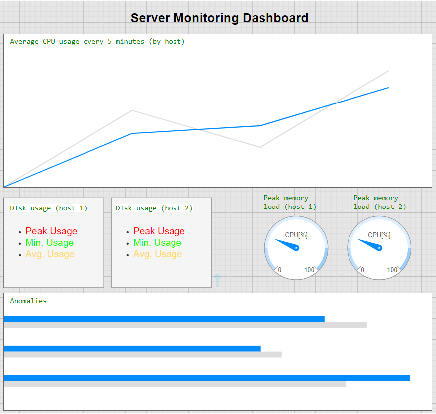
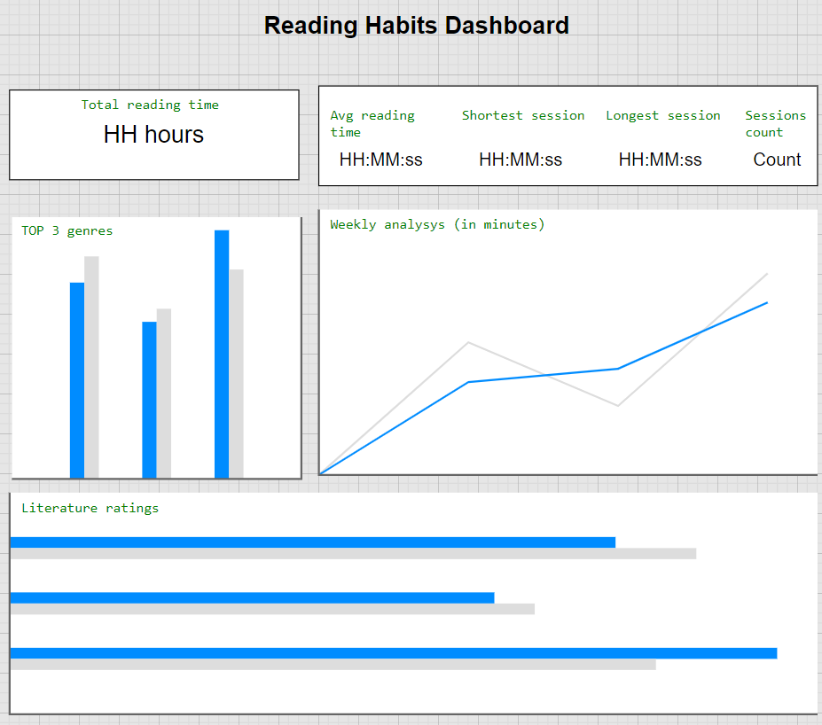

# Clickhouse Analytics Exercise

### Steps

1) Creation of tables **server_metrics** and **reading_habits** in the database (DDL in `sql/server_metrics.sql` and `sql/reading_habits.sql`);
2) Adjusting the connection parameters in `connectors/configs/auth_to_db.py` (`auth_to_db_example.py` provided as a template);
3) Generating the data and inserting into the DB from the files `server_metrics_gen.py` and `reading_data_gen.py` 
	via the command `python server_metrics_gen.py` for server metrics and `python reading_data_gen.py <desired row number>` for reading habits;
4) Originally, the dashboards were created in Grafana via the analytical queries from `sql/server_monitoring_queries.sql` and `sql/reading_habits_queries.sql`.
	Mockups of those dashboards are provided below.
	
***Server Monitoring***

***Reading habits***

### Stack

- Python
- Clickhouse
- Grafana (originally)/draw.io (mockup)

### Libraries

- [SQL Alchemy](https://www.sqlalchemy.org/)
- [Clickhouse Connect](https://clickhouse.com/docs/integrations/python)